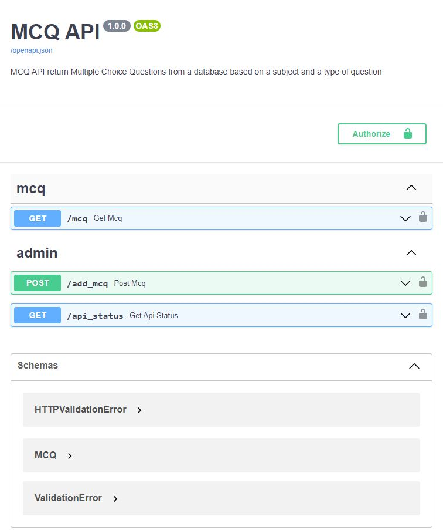
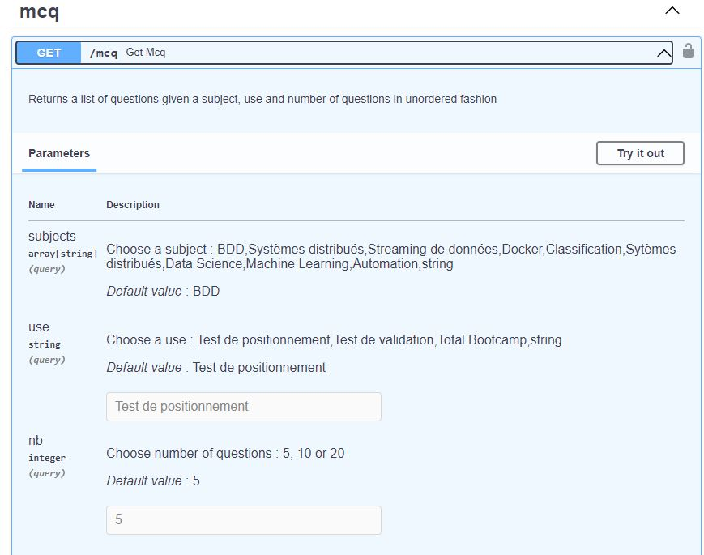
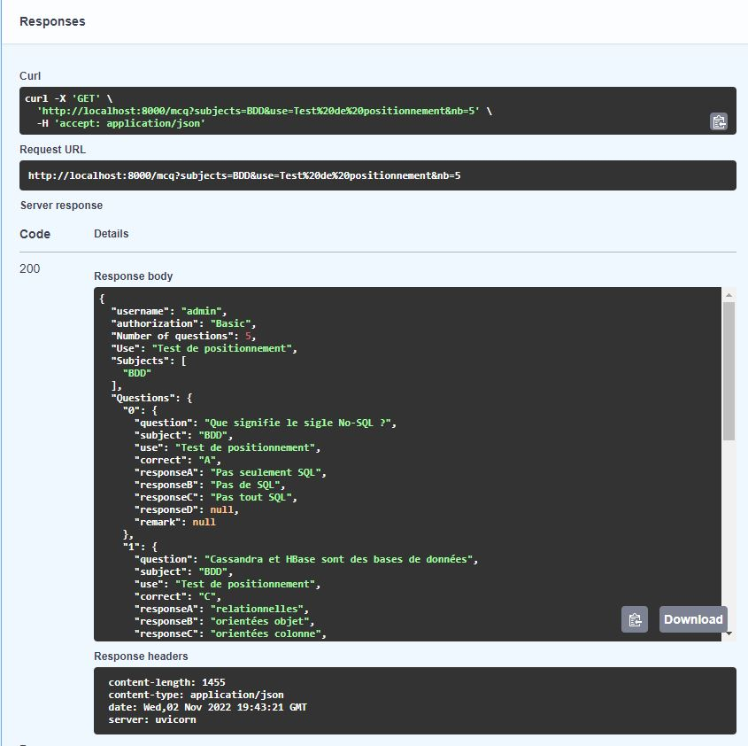
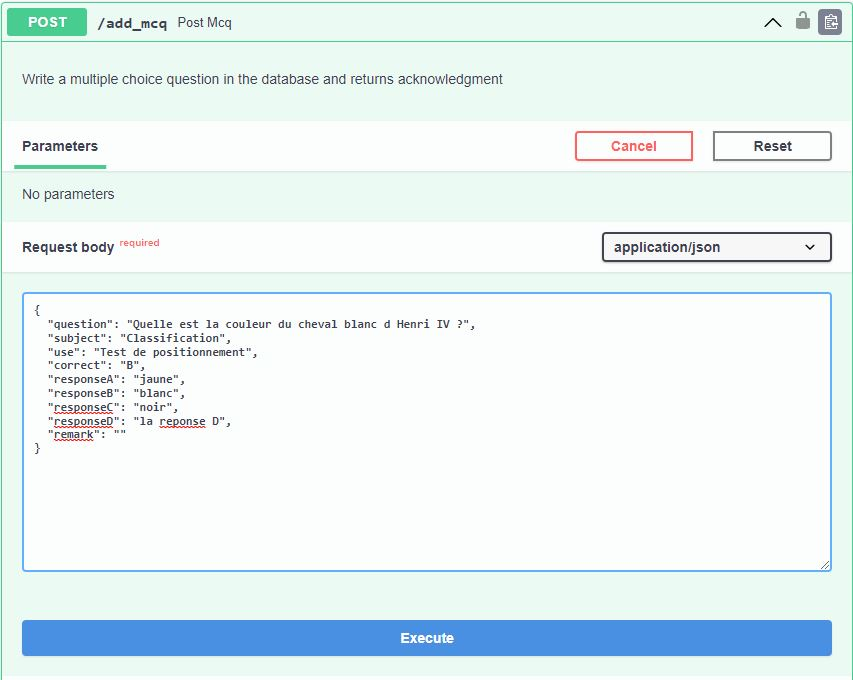
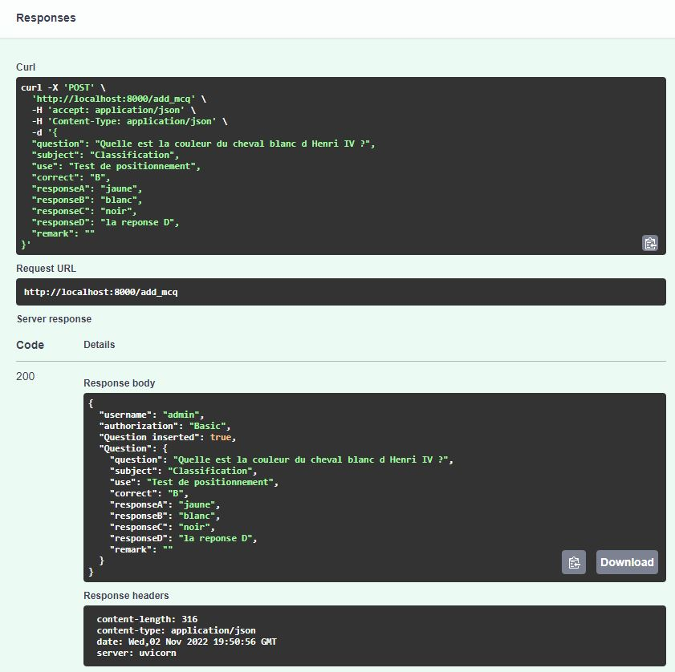
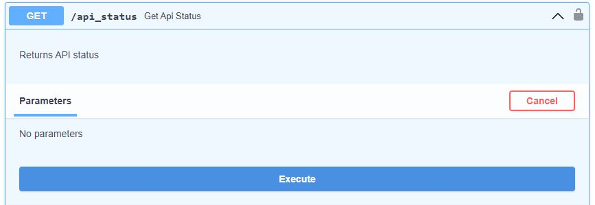
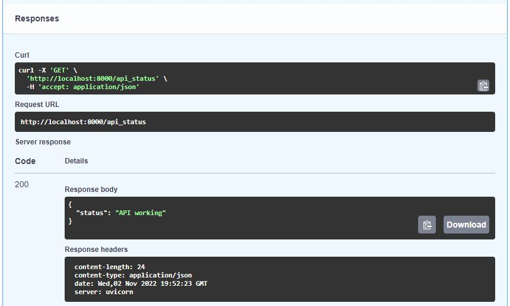

# MCQ API
The Multiple Choice Question API offers the users a set of questions based on a subject and a use (type)

# Data
The [questions.csv](questions.csv) file is the database that keeps all the questions with the following fields:
- `question`: the question itself
- `subject`: the question subject 
- `correct`: the correct answer to the question
- `use`: MCQ type 
- `responseA`: response A
- `responseB`: response B
- `responseC`: response C
- `responseD`: response D (if exists)

# API Specifications
1. The user must choose a test `use` as well as **one or more** test `subject`.
1. The API should be able to return quizzes with **5, 10 or 20** questions.
1. Order of the questions must be **random** when returned.
1. The API must **check the identity** of users depending on route used.
1. It uses a `Basic username:password` authentication process
1. API must have a route for the **API status check**
1. An **admin user** (username : `admin`, password: `4dm1N`)should be able to **add questions** to the database
1. Finally, the API should **return errors** when it is wrongly used

Following are the registered users
```json
{
  "alice": "wonderland",
  "bob": "builder",
  "clementine": "mandarine"
}
```

# Files
The API is made from the following files:

- [mcq_api.py](mcq_api.py) : the main app with the actual endpoints
- [mcq_utils.py](mcq_utils.py) : user database and various modules used in the main app. 
- [mcq_requests.py](mcq_requests.py) : script with requests made to test the API
- [questions.csv](questions.csv) : question database
- [requirements.txt](requirements.txt) : list of packages to install for the API to run

# Endpoints
| Endpoints       | Authentication | Description                                                                  |
|-----------------|----------------|------------------------------------------------------------------------------|
| GET /mcq        | USER           | returns a multiple choice question quizz based on **subjects** (*default* : `BDD`), **use** (*default* : `Test de positionnement`) and **nb** (*default* : `5`) |
| GET /api_status | ADMIN          | returns API status                                                           |
| POST /add_mcq   | ADMIN          | add new question in the database (`questions.csv`) from JSON/Dict Format     |

# Setup
Install the required packages :
```bash
pip install -r requirements.txt
```
Launch the uvicorn server :
```bash
uvicorn mcq_api:api --reload
```
The API is accessible in a browser at `http://127.0.0.1:8000`

To test the API with the [mcq_requests.py](mcq_requests.py) script :
```bash
python mcq_requests.py
```

# Results with API Interface

### API Interface


### MCQ parameters


### MCQ response


### Add MCQ parameters


### Add MCQ response


### API Status parameters


### API Status response



# Results for mcq_requests.py
```bash
# GET /mcq
response without parameters :
 {'detail': [{'loc': ['query', 'subjects'], 'msg': 'value is not a valid list', 'type': 'type_error.list'}]}

response without credentials :
 {'detail': 'Not authenticated'}

response with wrong parameter :
 {'detail': 'Bad Request : One or more parameter not valid'}

response with all needed :

{'username': 'clementine',
 'authorization': 'Basic',
 'Number of questions': 5,
 'Use': 'Test de positionnement',
 'Subjects': ['BDD', 'Systèmes distribués', 'Docker'],
 'Questions': {'19': {'question': 'DockerHub est',
                      'subject': 'Docker',
                      'use': 'Test de positionnement',
                      'correct': 'C',
                      'responseA': 'un système qui permet de lancer plusieurs '
                                   "containers d'un coup",
                      'responseB': "un système d'orchestration de containers",
                      'responseC': "un répertoire d'images Docker",
                      'responseD': None,
                      'remark': None},
               '17': {'question': 'Docker permet de persister des changements',
                      'subject': 'Docker',
                      'use': 'Test de positionnement',
                      'correct': 'C',
                      'responseA': 'Oui',
                      'responseB': 'Non',
                      'responseC': "Oui à condition d'utiliser des volumes",
                      'responseD': None,
                      'remark': None},
               '0': {'question': 'Que signifie le sigle No-SQL ?',
                     'subject': 'BDD',
                     'use': 'Test de positionnement',
                     'correct': 'A',
                     'responseA': 'Pas seulement SQL',
                     'responseB': 'Pas de SQL',
                     'responseC': 'Pas tout SQL',
                     'responseD': None,
                     'remark': None},
               '3': {'question': 'OrientDB et Neo4J sont des bases de données',
                     'subject': 'BDD',
                     'use': 'Test de positionnement',
                     'correct': 'D',
                     'responseA': 'relationnelles',
                     'responseB': 'orientées objet',
                     'responseC': 'orientées colonne',
                     'responseD': 'orientées graphe',
                     'remark': None},
               '18': {'question': 'Des containers Docker peuvent communiquer '
                                  'entre eux grâce à',
                      'subject': 'Docker',
                      'use': 'Test de positionnement',
                      'correct': 'B',
                      'responseA': 'des volumes',
                      'responseB': 'des networks',
                      'responseC': 'des communications ',
                      'responseD': None,
                      'remark': None}}}

# POST /add_mcq

response with data missing required fields :

{'detail': [{'loc': ['body', 'correct'],
             'msg': 'field required',
             'type': 'value_error.missing'},
            {'loc': ['body', 'responseA'],
             'msg': 'field required',
             'type': 'value_error.missing'}]}

response without credentials :
 {'detail': 'Not authenticated'}

response with wrong credentials :
 {'detail': 'Incorrect username or password'}

response with all needed :

{'username': 'admin',
 'authorization': 'Basic',
 'Question inserted': True,
 'Question': {'question': "Quelle est la couleur du cheval blanc d Henri IV ?",
              'subject': 'Classification',
              'use': 'Test de positionnement',
              'correct': 'B',
              'responseA': 'jaune',
              'responseB': 'blanc',
              'responseC': 'noir',
              'responseD': 'la reponse D',
              'remark': ''}}

la dernière ligne de questions.csv est maintenant:
Quelle est la couleur du cheval blanc d Henri IV ?,Classification,Test de positionnement,B,jaune,blanc,noir,la reponse D,


# GET /api_status

response with wrong credentials :
 {'detail': 'Incorrect username or password'}

response with all needed :
 {'status': 'API working'}
```